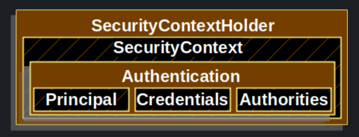
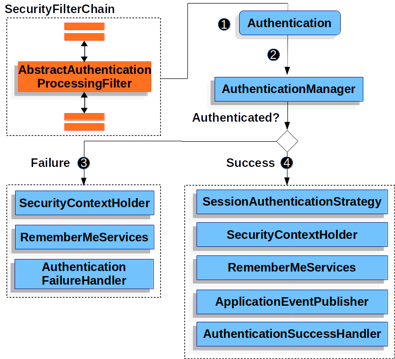

# SecurityContextHolder



SecurityContextHolder 는 Spring Security 에서 인증(authenticated)된 사용자의 정보를 저장한다.
그리고 Spring Security 는 SecurityContextHolder 에 뭐가 있는지 상관하지 않는다. 만약 SecurityContextHolder 안에 값이 채워져 있을 경우 그 값을 현재 사용자로 인식한다.
---

```java
class Holder {
    // 1. create an empty SecurityContextHolder
    SecurityContext securityContext = SecurityContextHolder.createEmptyContext();

    // 2. create an Authentication Object
    Authentication principal = new TestingAuthenticationToken("username", "password", "ROLE_USER");

    // 3. set the Authentication(principal) in the securityContext
    securityContext.setAuthentication(principal);

    // 4. set the Security Context in the SecurityContextHolder
    SecurityContextHolder.setContext(securityContext);

    // In the SecurityContext, now you can retrieve the information of the principal
    Authentication authentication = securityContext.getAuthentication();
    String getName = authentication.getName();
    var getPrincipal = authentication.getPrincipal();
    Collection<? extends GrantedAuthority> authorities = authentication.getAuthorities();

}
```

기본적으로 SecurityContextHolder는 ThreadLocal을 사용하여 보안 관련 정보(인증된 사용자의 정보 등)를 저장한다

> ThreadLocal? 자바에서 멀티스레드 환경에서 각 스레드에 고유한 값을 저장하고 관리할 수 있는 크래스.
> 하나의 변수를 여러 스레드가 공유하지 않고, 각 스레드 별로 독릭접으로 사용할 수 있게 해주는 클래스
> 멀티스레드 환경에서 전역 변수를 사용하거나 인스턴스 변수를 공유하는 경우, 여러 스레드가 해당 변수에 동시에 접근하면서 원치 않은 결과가 발생할 수 있음



1. 클라이언트가 id,pw 를 보낼경우 AbstractAuthenticationProcessingFilter 클래스에서 HttpServletRequest 에서 인증 할 수 있도록 Authentication 을 생성한다. 그리고
   Authentication 의 하위 클래스를 생성한다.(예 UsernamePasswordAuthenticationFilter 에서 HttpServletRequest 에서 요청온 id,pw 를 토대로 UsernamePasswordAuthenticationToken 을 생성 )
2. Authentication 가 AuthenticationManager 에 전달되어 인증과정을 거친다
3. 만약 실패할 경우
   - SecurityContextHolder 가 삭제됨
   - RememberMeServices.loginFail 호출
   - AuthenticationFailureHandler 호출
4. 만약 성공할 경우
   - SessionAuthenticationStrategy 새 로그인에 대한 알림이 표시
   - Authentication(사용자 정보) 가 SecurityHolder 에 설정됨
   - RememberMeServices.loginSuccess 호출
   - AuthenticationSuccessHandler 호출
