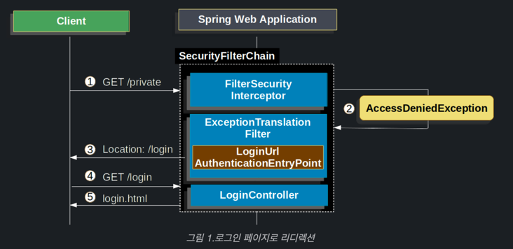
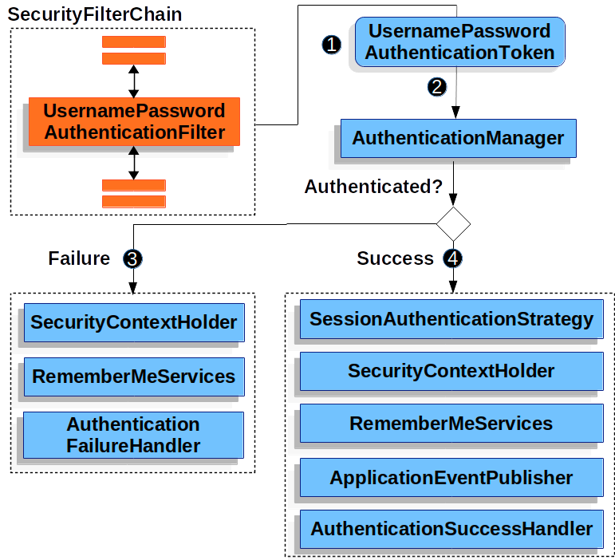

# FormLogin

이 섹션에서는 Spring Security 내에서 양식 기반 로그인이 작동하는 방식에 대해 설명한

----

### 1. 인증되지 않은 사용자

1. 사용자는 리소스에 인증되지 않은 요청을 한다.
2. Security 는 인증되지 않은 요청을 거부되었음을 나타낸 (AccessDeniedException)
3. 사용자가 인증되지 않았으므로 구성된 로그인 페이지로 리다이렉한다.(AuthenticationEntryPoint)
4. 브라우저가 리디렉션된 로그인 페이지를 서버에 요청한다.
5. 애플리케이션 내에서 로그인 페이지를 렌더링하여 사용자에게 전송한다

----

### 2. 인증 요청한 사용자

- ID,PW 가 제출이 되면,UsernamePasswordAuthenticationFilter 필터에서 ID,PW 를 인증한다.

1. 사용자가 ID,PW를 제출하면 UsernamePasswordAuthenticationFilter 가 UsernamePasswordAuthenticationToken을 생성한다.
    >    UsernamePasswordAuthenticationToken 는 Authentication 구현체임, HttpServletRequest 인스턴스를 이용해 ID,PW 를 추출한다.
2. 그 다음, UsernamePasswordAuthenticationToken 는 인증을 위해 AuthenticationManager 에 보내진다.
3. 인증에 실패한다면 Failure 
   - SecurityContextHolder 가 삭제된다
   - RememberMeServices.loginFail호출
   - AuthenticationFailureHandler호출
4. 인증에 성공
   - SessionAuthenticationStrategy새 로그인에 대한 알림이 표시
   - 인증에 성공한 Authentication 을 SecurityContextHolder 에 설정한다.
   - RememberMeServices.loginSuccess  호출
   - ApplicationEventPublisher를 게시
   - AuthenticationSuccessHandler 호출 (로그인 페이지로 리디렉션 할 때 ExceptionTranslationFilter에 의해 저장된 요청으로 리디렉션되는 SimpleUrlAuthenticationSuccessHandler 핸들러다)