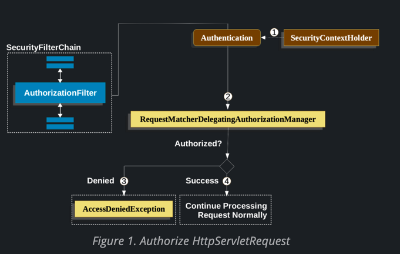

# HttpServletRequests 
인증/인가

----
스프링 시큐리티는 요청 수준에서 권한(인가)을 모델링 할 수 있도록 허용한다
예를 들어 스프링 시큐리티를 이용할 때, "/admin" 아래의 모든 페이지는 특정 권한을 요구하고, 다른 모든 페이지는 간단히 인증만 요구하도록 설할 수 있다.

기본적으로 스프링 시큐리티는 모든 요청이 인증된 상태여야 함을 요구한다.
그러나 HttpSecurity 인스턴스를 사용하는 모든 경우 권한 부여 규을 명시적으로 선언해야한다.

- 코드 예시
- 다음과 같이 "/admin" 아래의 모든 페이지는 "ROLE_ADMIN" 권한을 요구하고, 다른 모든 페이지는 간단히 인증만 필요로 할 수 있다.

```java
import org.springframework.context.annotation.Bean;

@Bean
public SecurityFilterChain filterChain(HttpSecurity http) throws Exception{
        http
        .authorizeHttpRequests(authorize -> authorize
        .requestMatchers("/admin/**").hasRole("ADMIN")
        .anyRequest().authenticated()
        )

        }
``` 


위의 설정에서는 "/admin/**" 페이지로 요청이 올 시,ROLE_ADMIN 권한을 요구한다.
또한 다른 모든 페이지 요청에 대해서는 인증만 요구하도록 설정되어있다.

## 요청 인가 구성 요소 작동 방식



1. 클라이언트가 요청을 보내면 해당 요청은 서블릿 컨테이너에 의해 받아지는데 이 요청을 스프링 시큐리티가 가로채서 보안 관련 작업을 수행한다. AuthorizationFilter는 SecurityContextHolder에서 인(Authentication) 을 검색하는 Supplier 를 생성한다.
2. 그 다음 AuthorizationFilter는 Supplier<Authentication>와 HttpServletRequest를 AuthorizationManager에 전달합니다. AuthorizationManager는 authorizeHttpRequests에 정의된 패턴과 요청을 비교하여 해당하는 규칙을 실행한다
3. 인가(Authorization)가 거부되면 AuthorizationDeniedEvent가 발행되고, AccessDeniedException이 발생한다. 이 경우 ExceptionTranslationFilter가 AccessDeniedException을 처리한다
4. 만약 접근이 허용되면 AuthorizationGrantedEvent가 발행되고, AuthorizationFilter는 FilterChain을 계속 진행하여 애플리케이션이 정상적으로 처리된다

> 요약
> 프링 시큐리티에서 AuthorizationFilter는 요청에 대한 인가를 처리하는 역할을 수행합한 후 인증된 사용자의
> 권한을 확인하여 접근을 허용하거나 거부하며, 이에 따라 이벤트를 발행하고 예외를 처리하여 보안을 관리한다.
> 접근이 허용되면 애플리케이션은 정상적으로 처리된다

----

#### AuthorizationFilter
- AuthorizationFilter는 기본적으로 필터 체인의 마지막에 배치되어 있다.

스프링 시큐리티에서 필터 체인은 여러 개의 필터로 구성되어 있으며 들어오는 요청을 처리한다
AuthorizationFilter 는 인증된 사용자가 요청한 리소스에 대한 필요한 권한을 갖고 있는지를 확인하는 역할을 담당한다
인증 정보가 필요하기 때문에 이 필터를 필터 체인의 마지막에 배치하는 것이 합리적이다
** . AuthorizationFilter 이전에 직접 필터를 추가한다면 해당 필터들도 인가를 요구하지 않을 것 **이며 그렇지 않으면 인가를 요구하게 된다

----

## Security Matchers
- RequestMatcher 인터페이스는 요청이 주어진 규칙과 일치하는지 판단하느데 사용한다.

```java

@Configuration
@EnableWebSecurity
public class SecurityConfig {

	@Bean
	public SecurityFilterChain securityFilterChain(HttpSecurity http) throws Exception {
		http
			.securityMatcher("/api/**")                           // 1                          
			.authorizeHttpRequests(authorize -> authorize
				.requestMatchers("/user/**").hasRole("USER")      // 2  
				.requestMatchers("/admin/**").hasRole("ADMIN")    // 3
				.anyRequest().authenticated()                     // 4            
			)
			.formLogin(withDefaults());
		return http.build();
	}
}
```

1. /api/로 시작하는 URL에만 HttpSecurity가 적용된다
2. /user/로 시작하는 URL은 "USER" 역할을 가진 사용자에게만 접근이 허용
3. dmin/로 시작하는 URL은 "ADMIN" 역할을 가진 사용자에게만 접근이 허용
4. 위의 규칙과 일치하지 않는 모든 요청에 대해서는 인증이 필요